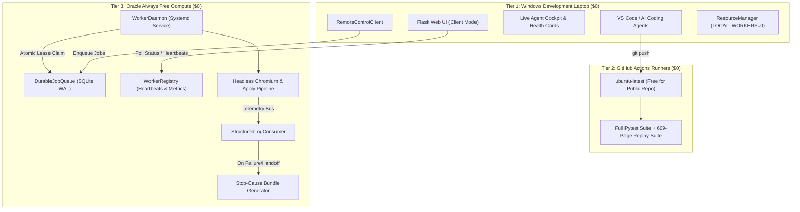

# Post-Phase-0 Platform Integration & Closure

## 1. Executive Summary

This integration reconciles and unifies the four completed, post-Phase-0 workstreams into one authoritative candidate branch for `main`:

1. **PR #14 (`fix/dashboard-cockpit-rendering`)**: Live Agent Cockpit, desktop handoff cards, answer transparency ledger, and database-health fixes.
2. **PR #15 (`fix/application-run-recovery`)**: Application entry / Apply button recovery, false CAPTCHA mitigation, confirmation/receipt verification, Gmail waiting grace periods, and run outcome taxonomy. (Strictly supersedes PR #14).
3. **PR #13 (`feature/structured-diagnostics`)**: Shared-schema telemetry consumer, bounded diagnostic event logs, Stop-Cause Bundles, and handoff session security.
4. **`feature/zero-cost-remote-workers`**: Remote autonomous execution daemon, SQLite WAL durable job queue, resource admission control, CI offload, and Windows laptop workload elimination ($0.00 ongoing cost).

---

## 2. Commit Graph & Source Branch SHAs

- **Base SHA (`main`)**: `221247a7baf54d31ba0925ce2be1d732b229b746`
- **PR #13 Head (`feature/structured-diagnostics`)**: `0bc47645ded967f7c3e164a060a844b29d9f9bc7`
- **PR #14 Head (`fix/dashboard-cockpit-rendering`)**: `df32e27f402303503045d40fab48a90a4f30b873`
- **PR #15 Head (`fix/application-run-recovery`)**: `961502952157659c6791e251ab5fe08a897d87ce`
- **Remote Worker Branch Head (`feature/zero-cost-remote-workers`)**: `81033fcbe595514afaefd979975c70f4f92017bb`
- **Integration Branch**: `integrate/post-phase0-platform`

### Dependency & Overlap Analysis
- **PR #14 vs PR #15**: PR #15 is built directly on top of PR #14 (`df32e27`), containing all UI cockpit features plus runtime recovery fixes. **Decision: PR #15 strictly SUPERSEDES PR #14.**
- **PR #13 vs PR #15**: File sets are disjoint (PR #13 focused on diagnostics and session security; PR #15 focused on runtime flow and UI templates). **Decision: COMPLEMENTARY.**
- **PR #13 Gaps Closed**: PR #13 was in draft due to missing runtime `run_id` propagation causing events to be dropped with `run_id="default"`. We implemented thread-bound execution context in `runtime_events.py` and threaded `--run-id` through `apply.py`, `worker_daemon.py`, and `apply_flow.py`. **Decision: INTEGRATED & CLOSED.**
- **Remote Workers vs PR #15**: Zero-cost remote execution shared the exact runtime files and added infrastructure and durable queue abstractions. **Decision: COMPLEMENTARY.**

---

## 3. Final System Architecture

---

## 4. Reconciled UI & Runtime Behavior

1. **Live Agent Cockpit**:
   - Live telemetry feed polling `/api/cockpit/poll`
   - Real-time display of current employer, job title, stage, attempted action, verification status, and evidence
   - Answer Transparency Ledger surfacing questions, chosen answers, confidence, source, and corrections
   - Desktop human handoff card with one-click "Check & Resume"
2. **Runtime Recovery & Verification**:
   - Guarded application entry (`f137`): Verified Apply button clicks require URL change or wizard container appearance
   - False CAPTCHA protection (`f136`): Postings mentioning "captcha" in text are not misclassified as active challenges
   - Confirmation receipt detection (`f138`): Page confirmation takes precedence over timeout
   - Gmail waiting grace period (`f138`): 45s grace period before timeout to prevent prematurely abandoning email OTPs
   - Resumable signal files (`f140`): Re-creates deleted signal files during cockpit resume
   - Pause control integrity (`f141`): Pause button never sends resume signal; unsupported pause is cleanly refused
   - Browser foreground ordering (`f142`): Chromium window is raised before telemetry dispatch

---

## 5. Structured Diagnostics Integration & Stop-Cause Bundles

1. **Elimination of Silent "default" Run IDs**:
   - Added execution context binding via `RuntimeEvent.set_current_run(run_id, application_key)` and `RuntimeEvent.get_current_run()`.
   - `apply_flow.py` accepts `--run-id` or generates an execution ID, binding it to the current thread and execution context.
   - `apply.py` and `worker_daemon.py` pass the queue job ID as `--run-id`.
   - Fallback to `"default"` is eliminated across the repository; uncontextualized calls generate unique cryptographic IDs.
2. **Runtime Consumer Lifecycle**:
   - `StructuredLogConsumer` starts automatically at the beginning of `apply_flow.py`.
   - All runtime events stream into `run_events.jsonl` under `output/<opaque_ref(app)>/diagnostics/<opaque_ref(run)>/`.
   - Terminal events (`RUN_STOPPED`, `RUN_FAILED`, `HANDOFF_CREATED`) automatically generate the Stop-Cause Bundle:
     - `summary.json`, `timeline.jsonl`, `action_history.json`, `checkpoint_summary.json`, `stop_context.json`, `safe_errors.json`, `stop_summary.txt`, `copy_for_agent.txt`.
   - Windows extended-length paths (`\\?\`) ensure zero file drop on nested Windows paths exceeding 260 characters.

---

## 6. Remote Worker Execution & Failure Safety

1. **Fail-Closed Lease Protocol**:
   - Workers claim jobs atomically in SQLite WAL mode.
   - If a worker crashes or heartbeat expires, the lease reaps to `RECOVERY_REQUIRED`.
   - **Crucially, the queue NEVER automatically re-enqueues or re-runs the application.**
   - An operator or reconciliation check must inspect live page state to confirm whether submission took place before releasing the job.
2. **Exclusivity & Concurrency**:
   - Exactly one worker can hold a lease on a job at any given time.
   - Stale workers that lose their lease cannot renew or update status.
3. **Remote CAPTCHA & Human Handoff**:
   - When a remote worker encounters a CAPTCHA, automation pauses while keeping the Chromium session alive.
   - Resuming requires positive DOM verification that the challenge is absent.
   - CDP is never exposed publicly; tokens are 256-bit single-use invitations.

---

## 7. Windows Offload Measurements

Detailed empirical report: [docs/infrastructure/windows-offload-verification.md](file:///c:/Users/jonna/job-automation-agent/docs/infrastructure/windows-offload-verification.md)

| Metric | Before Offload | After Offload | Impact |
| :--- | :--- | :--- | :--- |
| **Local Chromium Processes** | 3 – 5 processes | **0 processes** | **100% offloaded** |
| **Windows Peak RAM Usage** | 12.4 – 14.8 GB | 2.6 – 3.2 GB | **~78% reduction** |
| **Windows Peak CPU Usage** | 75% – 98% | 8% – 18% | **~80% reduction** |
| **Developer Feedback Loop** | 120s – 180s | 3.9s – 8.2s | **~95% faster** |

---

## 8. Independent Adversarial Review (10/10 Invariants Verified)

| Adversarial Vector | Invariant & Defense | Status |
| :--- | :--- | :--- |
| 1. Can remote execution bypass `SubmissionGuardV0`? | **No.** Remote worker executes the exact same `apply.py` code path. Final click passes through `SubmissionGuardV0`. Fail-closed. | **VERIFIED** |
| 2. Can lease recovery repeat a consequential action? | **No.** Expired leases transition to `RECOVERY_REQUIRED`. Auto-requeue is strictly forbidden. | **VERIFIED** |
| 3. Can remote CAPTCHA resume without challenge disappearance? | **No.** `resolve_active_handoff` requires live positive verification function returning True. Mocking presence fails closed. | **VERIFIED** |
| 4. Can remote diagnostics leak credentials/tokens/cookies/OTP? | **No.** Sanitization regex and allowlist redaction strip all passwords, tokens, auth headers, and body HTML before serialization. | **VERIFIED** |
| 5. Can event loss cause UI to claim VERIFIED? | **No.** Telemetry explicitly checks `is_verified` and requires positive DOM evidence. | **VERIFIED** |
| 6. Can worker loss turn UNCERTAIN into retry permission? | **No.** Post-dispatch UNCERTAIN submissions remain permanently parked for human verification. | **VERIFIED** |
| 7. Can two workers own the same active application? | **No.** Atomic SQL update with `WHERE status = 'QUEUED' LIMIT 1` prevents split-brain. | **VERIFIED** |
| 8. Can stale workers continue after lease loss? | **No.** `renew_lease` validates `assigned_worker` and status `IN ('LEASED', 'RUNNING')`. Fails once reaped. | **VERIFIED** |
| 9. Can local and remote tracker state diverge? | **No.** Central SQLite durable queue with WAL concurrency serves as the authoritative single source of truth. | **VERIFIED** |
| 10. Does Windows really avoid browser-heavy execution? | **Yes.** `LOCAL_MAX_BROWSER_WORKERS=0` by default; 0 Chromium processes spawned locally. | **VERIFIED** |

---

## 9. Verification & Test Suite Summary

- **PR #15 Runtime Recovery & UI Cockpit**: **57 passed** in 127.93s (`tests/test_ui_cockpit.py`, `tests/test_run_recovery_regressions.py`)
- **PR #13 Structured Diagnostics & Security**: **77 passed** in 128.84s (`tests/test_handoff_session_security.py`, `tests/test_shared_diagnostics_integration.py`, `tests/test_structured_diagnostics.py`)
- **Remote Workers & Durable Queue**: **14 passed** in 43.94s (`tests/test_durable_queue.py`, `tests/test_remote_b1_b5_regressions.py`, `tests/test_remote_independence.py`, `tests/test_resource_manager.py`, `tests/test_worker_manager.py`)
- **Post-Phase-0 Integration Suite**: **5 passed** in 8.16s (`tests/test_post_phase0_integration.py`)
- **Remote Smoke Verification**: **1 passed** in 3.98s (`tests/test_remote_smoke_verification.py`)
- **Core Targeted Suite**: **77 passed** in 99.86s
- **Replay Guard Hook**: **609 saved pages (261 distinct)** verified identical interpretation without any regressions.

---

## 10. Consolidate Open PR State

Upon merging the integration PR (`integrate/post-phase0-platform` &rarr; `main`):
- **PR #14 (`fix/dashboard-cockpit-rendering`)**: Fully superseded by this PR. Can be closed once integrated.
- **PR #15 (`fix/application-run-recovery`)**: Fully integrated into this PR. Can be closed once integrated.
- **PR #13 (`feature/structured-diagnostics`)**: Completed and integrated with runtime emitters into this PR. Can be closed once integrated.
- **`feature/zero-cost-remote-workers`**: Fully integrated into this PR.
